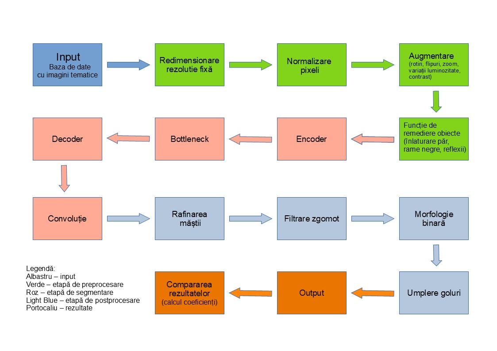

# Segmentarea leziunilor de piele

> Acest proiect a fost realizat de către Bejenariu Codrin-Gigel și Condurache Gabriel-Florin

## Cuprins

1. [Introducere](#introducere)
2. [Arhitectura U^2-Net](#arhitectura-u2-net)
3. [Arhitectura proiectului](#arhitectura-proiectului)
    - [Input](#1-input)
    - [Etapa de preprocesare](#2-etapa-de-preprocesare)
    - [Etapa de segmentare](#3-etapa-de-segmentare-arhitectura-u2-net)
    - [Etapa de postprocesare](#4-etapa-de-postprocesare)
    - [Output](#5-output)
    - [Compararea rezultatelor](#6-compararea-rezultatelor)
4. [Rezultate](#rezultate)
5. [Componente Software și Hardware](#componente-software-și-hardware)
6. [Referințe bibliografice](#referințe-bibliografice)

## Introducere
În medicina modernă, identificarea leziunilor cutanate poate fi dificilă
din cauza variațiilor de culoare, formă și textură, iar evaluarea
vizuală poate deveni subiectivă. Astfel, se utilizează metode automate
de analiză și segmentare a imaginilor.

În această lucrare vom implementa și evalua arhitectura U^2-Net, o evoluție 
avansată a modelului clasic, caracterizată printr-o structură imbricată de tip „U-în-U” (ReSidual U-blocks). 
Această arhitectură este concepută pentru a captura informații contextuale la scări multiple, fiind capabilă 
să segmenteze detalii fine fără a pierde informația globală și fără a necesita un cost computațional excesiv. 
Scopul lucrării este reprezentat ca și experiment didactic despre modul în care U^2-Net poate îmbunătăți 
detectarea automată a leziunilor pielii față de metodele standard, parcurgând etapele complete de preprocesare, 
antrenare deep learning și postprocesare a măștilor de segmentare, dar și o familiarizare mai amânuntă.

## Arhitectura U^2-Net

> **Notă:** Această implementare are la bază codul sursă original al lucrării [U^2-Net](https://github.com/xuebinqin/U-2-Net), scris de către Xuebin Qin, Zichen Zhang, Chenyang Huang, Masood Dehghan, Osmar R. Zaiane și Martin Jagersand

> Această implementare are un caracter strict didactic. Deși aplicată pe un set de date medical (segmentarea leziunilor cutanate), **obiectivul principal al lucrării este aprofundarea tehnicilor avansate de Procesare a Imaginilor (Image Processing)** și înțelegerea modului în care rețelele neuronale profunde pot extrage caracteristici vizuale complexe. Secundar, proiectul urmărește familiarizarea cu provocările specifice imagisticii medicale (zgomot, contrast scăzut, forme neregulate).

## Arhitectura Proiectului

### 1\. Input 

  - reprezintă baza de date, informațiile date fiind imaginile cu leziunile 
cutanate ce vor intra în sistemul implementat, cu scopul de segmentare 
a leziunilor detectate. Sursa bazei de date utilizate va fi oferită de 
către ISIC prin următorul link: <https://www.isic-archive.com/>

### 2\. Etapa de preprocesare

**2.1. Redimensionare rezoluție fixă**

  - imaginile originale pot avea dimensiuni diferite, orientări diferite sau
rapoarte de aspect variabile. Pentru o consistență între imagini sau
pentru a permite o procesare unitară în rețea, imaginile vor fi scalate
la o rezoluție standard.

**2.2. Normalizare pixeli**
  - valorile pixelilor pot aduce multe variații de iluminare. Astfel, pentru
a îmbunătăți stabilitatea optimizării în timpul antrenării, vom converti
valorile pixelilor din intervalul 0-255, într-un interval standard.

**2.3. Augmentare**
  - imaginile primite din input, pot fi realizate din diverse unghiuri sau
anumite poziții care pot îndepărta acuratețea rezultatelor de cele
dorite la finalul acestui experiment. Astfel, prin trecerea imaginilor
prin acest bloc de augmentare, dorim să rotim imaginile primite, putem
face un flip, o scalare sau o reglare de contrast, cu scopul de a spori
acuratețea rezultatelor la final și pentru a generaliza modelul la
anumite imagini model clasice.

**2.4. Funcția de remediere a obiectelor**
   - constă în implementarea unor filtre speciale pentru îmbunătățirea
calității imaginii, evidențiind structura reală a leziunii, prin
îndepărtarea firelor de păr, a reflexiilor din poză, a ramelor negre,
sau a altor factori ce pot afecta structura leziunii țintă.

### 3. Etapa de segmentare (Arhitectura U^2-Net)

**3.1. Encoder (Codificatorul)**
- Spre deosebire de U-Net-ul clasic, encoderul U^2-Net este compus din 6 etape, fiecare etapă fiind constituită din blocuri **RSU (Residual U-blocks)**.
  Practic, fiecare bloc al encoderului conține la rândul său o structură internă de tip U-Net.
  Aceste blocuri permit extragerea caracteristicilor multi-scalare (atât detalii locale, cât și context global) direct în interiorul fiecărui strat,
  fără a degrada rezoluția hărților de caracteristici prea rapid.

**3.2. Bottleneck (Zona de adâncime)**
- Reprezintă punctul de cea mai mare adâncime a rețelei (etapele En_5, En_6 și De_5). Aici, U^2-Net utilizează blocuri speciale **RSU-4F** bazate pe **convoluții dilatate** (dilated convolutions).
  Scopul este de a capta caracteristici globale și contextuale extinse fără a mai reduce rezoluția spațială (downsampling),
  prevenind astfel pierderea detaliilor fine ale leziunii care s-ar produce prin micșorarea excesivă a imaginii.

**3.3. Decoder (Decodificatorul)**
- Are rolul de a reconstrui rezoluția spațială a imaginii, similar encoderului, fiind structurat tot pe blocuri RSU. Acesta primește informații de la encoder
  prin **conexiuni de sărit (skip connections)**, concatenând hărțile de caracteristici de rezoluție înaltă din encoder cu cele procesate din decoder.
  Particularitatea U^2-Net este că generează o hartă de segmentare intermediară (Side Output) la fiecare etapă a decoderului, permițând o supervizare profundă a antrenării.

**3.4. Fuziunea și Rezultatul Final**
- La finalul etapei de segmentare, nu avem o singură ieșire, ci 6 hărți de probabilitate generate de fiecare nivel al decoderului.
  Acestea sunt readuse la dimensiunea originală prin up-sampling și concatenate. Printr-o operație de convoluție finală 1x1, aceste hărți sunt **fuzionate**
  pentru a genera rezultatul final. Această strategie asigură că segmentarea finală beneficiază atât de detaliile fine (de la straturile superficiale),
  cât și de contextul semantic (de la straturile profunde).

### 4\. Etapa de postprocesare

**4.1. Rafinarea măștii**

  - constă în aplicarea unor operații de netezire, clarificare a conturului,
sau de eliminarea pixelilor izolați. Aceste operații sunt realizate, ca
urmare a unor erori la marginile măștii brute.

**4.2. Morfologie binară**

  - pentru îmbunătățirea calității vizuale și structurale a măștii, se
realizează extinderi ale anumitor zone din cadrul imaginii, reduceri de
structuri din cadrul imaginii prin eroziuni și operații de netezire a
conturului.

**4.3. Umplere goluri**
  - spațiile rămase în interiorul măștii sunt completate pentru a produce un
obiect compact, uniform și continuu.

### 5\. Output 
  - se obține imaginea binară care evidențiază zona exactă a
leziunii pe piele.

### 6\. Compararea rezultatelor

  - în urma procesării imaginilor, sistemul va calcula acuratețea atinsă la
finalul implementării pentru a putea încheia experimentul didactic și de
a compara rezultatele lucrării cu alte lucrări științifice.

## Rezultate
  - to-do

## Componente Software și Hardware
    
- software: VisualStudio Code, Python 3.14
- hardware:  
       - procesor: AMD Ryzen™ AI 9 HX 370  
       - ram: 32GB LPDDR5X 7500  
       - placa video: NVIDIA® GeForce RTX™ 4060 Laptop GPU

## Referințe bibliografice

| Nr. | Autor(i) / An | Titlul articolului / Proiectului | Aplicație / Domeniu | Tehnologii utilizate | Metodologie / Abordare | Rezultate | Limitări | Comentarii suplimentare |
|-----|----------------|----------------------------------|----------------------|-----------------------|-------------------------|------------|------------|---------------------------|
| 1 | Shudipto Sekhar Roy / 2025 | melSeg: An Adaptation of Segment Anything Model for Skin Lesion Segmentation | Segmentarea leziunilor pielii (melanom) | Segment Anything Model, Feature Pyramid Network, Deep Learning | Adaptarea SAM pentru segmentarea leziunilor prin încorporarea unui FPN pentru a îmbunătăți captarea caracteristicilor la scări multiple | Model evaluat pe setul de date HAM10000. Rezultă un procentaj de reușită de 94,19% și o segmentare reușită de 89,29% | Limitări hardware, consum ridicat de GPU | Căutarea îmbunătățirii modelului pe alte baze de date promițătoare |
| 2 | Maria Tamoor / 2023 | Skin Lesion Segmentation Using an Ensemble of Different Image Processing Methods | Segmentarea leziunilor pielii | Active contour model, Hawk thresholding, Otsu thresholding, Gray thresholding, Kapur thresholding | Folosirea unui ansamblu de metode pentru o reușită optimă a segmentării leziunilor pielii | Bazat pe găsirea unui prag optim, modelul ajunge la o reușită de 96,5% pentru diferite imagini | Găsirea unei metode optime poate fi dificilă din cauza neomogenității, zgomotului și altor factori din imagini | Cercetarea poate fi extinsă și pentru alte specializări din imagistica medicală (CMR, ultrasunete, tomografie) |
| 3 | Bill S. Lin / 2017 | Skin Lesion Segmentation: U-Nets versus Clustering | Segmentarea leziunilor pielii | U-Nets, Clustering C-Means, Preprocesare bazată pe egalizarea histogramei | Compararea U-Nets (cu preprocesare) și o variantă minimalizată cu Clustering C-Means | Rezultate pozitive pentru segmentare utilizând U-Nets. Rețeaua a necesitat doar 1% din numărul de iterații de antrenament comparativ cu alte metode. | Deoarece nu este folosită o placă video, numărul de operații de antrenare este extrem de limitat | În viitor ar fi interesant de analizat dacă pasul de preprocesare (egalizarea histogramei) îmbunătățește semnificativ performanța segmentării prin modificarea numărului de epoci al U-Net-ului și folosirea unui GPU |
| 4 | Ali Karimi / 2023 | DEU-Net: Dual-Encoder U-Net for Automated Skin Lesion Segmentation | Segmentarea leziunilor pielii | Dual-Encoder U-Net, Transformer Encoder, Convolutional Encoder, Arhitectură Encoder-Decoder | Utilizarea unei noi rețele U-Net care folosește o ramură duală de encodere (CNN și Transformer) pentru a extrage simultan caracteristici locale și informații contextuale globale | DEU-Net a obținut performanțe superioare metodelor de ultimă generație pe seturile ISIC-2016-2017-2018 și PH2 | Modelul are dificultăți în segmentarea leziunilor cu margini foarte neregulate sau contrast redus între leziune și piele | Autorii propun, pentru lucrări viitoare, optimizarea mecanismului de fuziune dintre cele două ramuri encoder |
| 5 | Manoranjan Dash / 2019 | PsLSNet: Automated psoriasis skin lesion segmentation using modified U-Net-based fully convolutional network | Segmentarea leziunilor pielii | Psoriasis Lesion Segmentation Network, Modified U-Net, Fully Convolutional Network, Deep Learning | Propunerea unei rețele FCN bazate pe o arhitectură U-Net modificată pentru a aborda dificultățile de segmentare ale leziunilor psoriazice (iluminare slabă, forme neregulate, margini neclare) | Modelul a obținut o acuratețe de 94,80%, coeficient Dice de 93,03% și index Jaccard de 86,40% | Scăderea performanței în prezența părului, luminii slabe, umbrelor și contrastului redus între leziune și pielea sănătoasă | Extinderea bazei de date și integrarea evaluării automate a severității psoriazisului. Modelul poate detecta și zone de piele sănătoasă în interiorul leziunilor, lucru pe care metodele anterioare nu îl reușeau |

